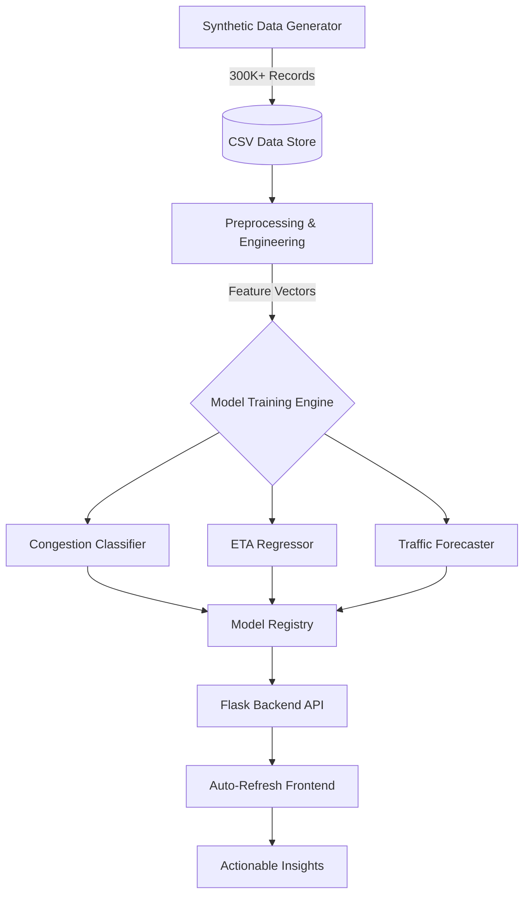

# 🚦 Bangalore Traffic AI: Smart Urban Mobility Platform

[](https://www.python.org/)
[](https://flask.palletsprojects.com/)
[](https://xgboost.ai/)
[](https://leafletjs.com/)
[](https://opensource.org/licenses/MIT)

An **AI-driven, production-grade traffic intelligence platform** designed to solve the urban mobility crisis in Bangalore. This system leverages advanced Machine Learning (XGBoost, Scikit-Learn) to provide real-time congestion insights, accurate ETA estimations, and smart route recommendations.

---

## 🌟 Key Features

### 🧠 AI Core
- **Congestion Predictor**: Classification of traffic levels (Low, Medium, High, Severe) with >90% confidence.
- **Smart ETA Estimator**: Real-time travel time calculation adjusted for weather, distance, and road type.
- **Dynamic Forecasting**: Multi-hour traffic index forecasting using lag-feature-based XGBoost models.
- **Optimal Departure Suggester**: Suggests the best time to leave to minimize commute stress.

### 📊 Visualization & UI
- **Live Analytics Dashboard**: Auto-refreshing charts (every 30s) showing hourly trends, weather impact, and area-wise traffic.
- **Digital Twin Map**: Interactive geospatial visualization of Bangalore's 20+ key hubs using Leaflet.js.
- **Premium Aesthetics**: A sleek, glassmorphism-inspired dark mode interface with smooth transitions and micro-animations.

### 🏗️ MLOps Pipeline
- **High-Fidelity Simulation**: Synthetic data generator producing 300,000+ realistic traffic records.
- **Robust Feature Engineering**: Cyclical time encoding, route risk scoring, and precipitation impact matrices.
- **Fault-Tolerant Inference**: Independent model loading with automatic fallback mechanisms.

---

## 🏗️ System Architecture



---

## 🚀 Installation & Setup

### 1. Environment Configuration
```bash
# Clone the repository
git clone https://github.com/your-username/banglore-traffice.git
cd banglore-traffice

# Create virtual environment
python -m venv venv
source venv/bin/activate  # On Windows: venv\Scripts\activate

# Install dependencies
pip install -r requirements.txt
```

### 2. Data & Model Pipeline
The system requires pre-trained models. Run the following in order:
```bash
# 1. Generate the dataset
python src/data_generator.py

# 2. Preprocess & Feature Engineering
python src/preprocess.py

# 3. Train all models
python src/train.py
```

### 3. Launching the App
```bash
python app.py
```
Open `http://127.0.0.1:5000` in your browser.

---

## 📁 Project Structure

| File/Folder | Description |
| :--- | :--- |
| `app.py` | Flask server, API endpoints, and custom JSON serialization. |
| `src/` | **The Brain**: Data generation, training, and inference logic. |
| `static/` | CSS3 (Premium styles) and JS (Chart.js & Leaflet logic). |
| `templates/` | HTML5 semantic templates for all pages. |
| `data/` | CSV datasets (Raw, Cleaned, Engineered). |
| `models/` | Serialized `.pkl` models and feature mapping JSONs. |

---

## 📡 API Reference

### Get Analytics Data
`GET /api/analytics`
- **Returns**: Real-time sampled statistics for the dashboard.
- **Features**: Auto-refreshes every 30s in the UI.

### Predict Traffic
`POST /predict`
- **Payload**: `{ source, destination, hour, weather, ... }`
- **Returns**: Congestion level, ETA, recommended route, and hourly forecast.

---

## 🧠 Model Specifications

| Model | Algorithm | Input Features |
| :--- | :--- | :--- |
| **Congestion** | XGBoost Classifier | 35+ (Time, Weather, Distance, Risk Score) |
| **ETA** | RandomForest Regressor | Distance, Avg Speed, Road Capacity, Time |
| **Forecast** | XGBoost (Lagged) | Lagged Traffic Indices, Rolling Mean, Hour-Sin/Cos |

---

## 🛠️ Tech Stack

- **Backend**: Flask (Python 3.13)
- **Frontend**: Vanilla JS, Leaflet.js, Chart.js 4.4
- **ML Engine**: Scikit-Learn, XGBoost, Pandas, NumPy
- **Styling**: CSS3 (Glassmorphism, Flexbox, Grid)

---

## 🤝 Contributing

We welcome contributions to help improve Bangalore's urban mobility!
1. Fork the Project
2. Create your Feature Branch (`git checkout -b feature/NewRoute`)
3. Commit your Changes (`git commit -m 'Add new route prediction'`)
4. Push to the Branch (`git push origin feature/NewRoute`)
5. Open a Pull Request

---

## 📜 License

Distributed under the MIT License. See `LICENSE` for more information.

---
**Crafted for a smarter, faster, and more efficient Bengaluru.** 🌆
